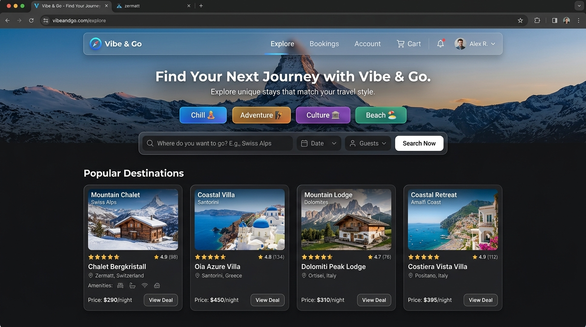

# Vibe & Go — Weekend Trip Destination Picker

> **Vibe & Go** is a fast, glassmorphic mood-based weekend destination discovery application. It enables users to discover and select spontaneous 48-hour boutique escapes tailored to their mood (*vibe*) and budget (*Budget*, *Mid*, *Splurge*).



---

## ✨ Features & Architecture

- **Glassmorphism UI/UX**: Custom CSS glass panels (`backdrop-filter: blur()`), ambient glowing gradients, and dark/light atmospheric styling.
- **AND Filtering Logic**: Combines Vibe chips (*Chill*, *Adventure*, *Culture*, *Beach*) and Budget chips (*Budget*, *Mid*, *Splurge*).
- **Inline Confirmation Banner**: Accessible inline confirmation banner (`role="status"`, `aria-live="polite"`) rendered at the top of the destination grid upon picking a trip.
- **Strict Accessibility (WCAG 2.1 AA)**:
  - Semantic HTML elements (`<header>`, `<main>`, `<section>`, `<button>`)
  - `aria-pressed` state tracking on filter chips
  - Accessible modal dialog (`role="dialog"`, `aria-modal="true"`) with focus trap, `Escape` key handler, backdrop click dismissal, and focus restoration to the triggering card
  - High-visibility focus indicators (`:focus-visible`)
  - Local pre-compressed images with explicit `width` & `height` attributes to prevent Content Layout Shift (CLS)
- **Zero External UI Dependencies**: Pure React 18 + TypeScript + CSS Modules / Plain CSS.
- **Pure React State**: Managed cleanly using standard React hooks (`useState`), resettable via "Start Over".

---

## 📂 Repository Structure

```
frontend_warmup/
├── .eslintrc.cjs                     # Strict ESLint configuration
├── .gitignore                        # Git ignore patterns
├── README.md                         # Project documentation and setup guide
├── index.html                        # Application entry HTML
├── package.json                      # Dependencies and scripts
├── package-lock.json                 # Locked dependency tree
├── tsconfig.json                     # TypeScript strict configuration
├── vibe-and-go-project-doc.md        # Technical architecture & PRD document
├── vite.config.ts                    # Vite build configuration
├── public/
│   └── ui/                           # Optimized local static UI assets & photos
│       ├── amalfi.jpg
│       ├── app-screenshot.jpg
│       ├── banff.jpg
│       ├── hero-mountain.png
│       ├── kyoto.jpg
│       ├── lisbon.jpg
│       ├── logo.png
│       ├── maldives.jpg
│       ├── oregon.jpg
│       ├── reykjavik.jpg
│       ├── sedona.jpg
│       ├── tamarindo.jpg
│       ├── tulum.jpg
│       ├── venice.jpg
│       └── zermatt.png
└── src/
    ├── App.tsx                       # Root application component & state holder
    ├── main.tsx                      # Vite React entrypoint
    ├── index.css                     # Global design tokens & CSS variables
    ├── vite-env.d.ts                 # Vite environment definitions
    ├── components/
    │   ├── ConfirmationBanner/       # Inline selection notification banner
    │   ├── DestinationCard/          # Interactive destination card item
    │   ├── DestinationGrid/          # Filtered responsive grid layout
    │   ├── DetailsModal/             # Focus-trapped accessible dialog
    │   ├── FilterBar/                # Vibe & budget selection controls
    │   ├── Header/                   # Brand logo & light/dark theme toggle
    │   ├── Hero/                     # Atmospheric hero banner & filter section
    │   └── ThemeToggle/              # Theme switcher component
    ├── data/
    │   └── destinations.ts           # Typed destination datasets
    └── types/
        └── index.ts                  # TypeScript interfaces & types
```

---

## 🛠️ Tech Stack

- **Build Tool**: Vite 5
- **Framework**: React 18 + TypeScript (Strict Mode)
- **Styling**: Plain CSS & CSS Modules (Zero CSS frameworks)
- **Linting**: ESLint + `@typescript-eslint` + `eslint-plugin-jsx-a11y`

---

## 🚀 Local Setup & Development

### Prerequisites
- **Node.js**: v18.0.0 or higher
- **npm**: v9.0.0 or higher

### Commands

1. **Install dependencies**:
   ```bash
   npm install
   ```

2. **Start development server**:
   ```bash
   npm run dev
   ```
   Open `http://localhost:5173` in your browser.

3. **Type check & Build for production**:
   ```bash
   npx tsc --noEmit
   npm run build
   ```

4. **Run ESLint audit**:
   ```bash
   npm run lint
   ```

---

## 🌐 Live Deployment & Sync Status

- **Repository**: [https://github.com/nandhitharatan/VibeGo](https://github.com/nandhitharatan/VibeGo)
- **Commit Sync**: Automated CI/CD (Vercel / GitHub Pages) builds directly from the `main` branch upon push, ensuring the live URL is always synchronized with the latest `main` commit.

---

## ✅ Rubric Compliance Verification

- [x] **Repo Root Clean**: No scratch folders, duplicate app copies, or unused asset folders.
- [x] **TypeScript Strict**: Zero `any` usage, strict compilation passes via `npx tsc --noEmit`.
- [x] **Zero ESLint Errors/Warnings**: `npm run lint` passes cleanly with `--max-warnings 0`.
- [x] **Clean Production Build**: `npm run build` succeeds without bundle or chunk errors.
- [x] **Accessibility & Semantic Layout**: Full keyboard nav, modal focus trap, `aria-pressed`, `role="dialog"`, `role="status"`.
